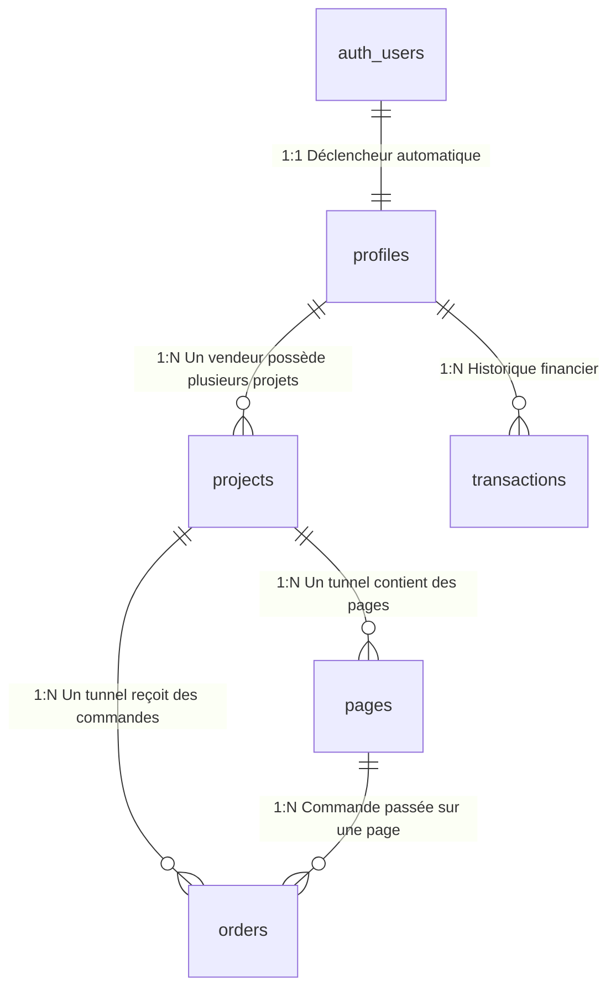

# 🗄️ Tuneliva - Explication Complète de la Base de Données (Database Explanation)

> Ce document explique le rôle, la conception, les relations et la logique métier derrière chaque table du schéma PostgreSQL / Supabase de **Tuneliva**.

---

## 1. Vue d'Ensemble des Relations (Diagramme ERD)

---

## 2. Analyse Détaillée des Tables

### 1. `profiles` (Profils Utilisateurs)
* **But :** Stocke les informations spécifiques aux vendeurs inscrits sur Tuneliva (extension de la table interne `auth.users` de Supabase).
* **Colonnes Clés :**
  * `id` (UUID) : Clé primaire, liée directement à `auth.users.id` avec suppression en cascade.
  * `wallet_credits` (INTEGER, défaut : 50) : Nombre de leads / commandes Cash on Delivery que l'utilisateur peut recevoir. À chaque commande COD, 1 crédit est débité. 50 crédits sont offerts à l'inscription pour tester l'outil gratuitement.
  * `preferred_currency` : Devise de référence du compte vendeur (ex: `XOF` pour le Bénin, `EUR` pour la France).
  * `plan_tier` : Formule d'abonnement (`free`, `pro`, `agency`).
* **Déclencheur associé :** `on_auth_user_created` crée automatiquement une ligne dans cette table dès qu'un utilisateur s'inscrit via Google, Email ou Téléphone.

---

### 2. `projects` (Projets / Tunnels de Vente)
* **But :** Représente un site ou un tunnel de vente d'un vendeur.
* **Colonnes Clés :**
  * `slug` (TEXT, UNIQUE) : Identifiant unique utilisé pour le sous-domaine automatique (ex: `chaussures-pro.tuneliva.app`).
  * `custom_domain` (TEXT, UNIQUE) : Nom de domaine propre que le vendeur peut brancher (ex: `www.chaussures-pro.com`).
  * `whatsapp_number` (TEXT) : Numéro au format international (ex: `+22997000000`) vers lequel les commandes WhatsApp sont routées avec message pré-rempli.
  * `fedapay_public_key` & `paystack_public_key` : Permet au vendeur d'encaisser directement sur ses propres comptes de passerelles s'il le souhaite.
  * `is_published` (BOOLEAN) : Détermine si le tunnel est accessible publiquement par les acheteurs.

---

### 3. `pages` (Pages Web du Tunnel)
* **But :** Stocke le contenu de chaque page individuelle d'un projet (Page de capture, Page de vente principale, Page de remerciement).
* **Colonnes Clés :**
  * `content` (JSONB) : **Le cœur du moteur Tuneliva**. Ce champ stocke l'arborescence complète des blocs générés par l'IA ou édités par le vendeur (Hero, Preuves sociales, Formulaire, Tarifs, FAQ). Le format JSONB permet une flexibilité totale sans alourdir la base de données.
  * `is_home` (BOOLEAN) : Désigne la page d'atterrissage principale servie à la racine du sous-domaine (`/`).
  * `views_count` (INTEGER) : Compteur de visites pour calculer le taux de conversion de la page.
* **Relations :** `project_id` relie la page à son projet parent (`ON DELETE CASCADE`).

---

### 4. `orders` (Commandes Reçues)
* **But :** Enregistre chaque achat ou intention d'achat effectuée par un visiteur sur la page de vente.
* **Colonnes Clés :**
  * `payment_method` :
    * `cod` : Paiement en espèces à la livraison.
    * `whatsapp` : Commande finalisée via la messagerie WhatsApp.
    * `fedapay` : Paiement en ligne Mobile Money (MTN, Moov, Orange, Wave).
    * `paystack` : Paiement par carte bancaire ou Mobile Money anglophone.
    * `stripe` : Paiement international.
  * `order_status` : Suivi logistique (`new` $\rightarrow$ `confirmed` $\rightarrow$ `shipped` $\rightarrow$ `delivered` ou `cancelled`).
  * `payment_status` : Statut financier (`pending`, `paid`, `failed`).
* **Sécurité :** Les visiteurs ont le droit d'insérer de nouvelles commandes (`INSERT`), mais seuls les propriétaires du projet peuvent lire (`SELECT`) et modifier le statut (`UPDATE`) de leurs commandes.

---

### 5. `transactions` (Paiements SaaS Tuneliva)
* **But :** Historique des encaissements propres à la plateforme Tuneliva (abonnements Pro à 5 000 FCFA/mois ou recharges du portefeuille de crédits de commandes).
* **Colonnes Clés :**
  * `type` : `subscription_pro`, `credit_topup`, `commission_fee`.
  * `reference` : Référence unique retournée par FedaPay / Paystack pour éviter les fraudes et doubles crédits (idempotence).

---

## 3. Sécurité Row Level Security (RLS)

Chaque table possède des politiques de sécurité strictes activées par défaut :
* **Isolation complète des vendeurs** : L'utilisateur connecté avec l'ID `auth.uid()` ne peut jamais voir ni manipuler les données d'un autre utilisateur.
* **Accès public contrôlé** :
  * Les visiteurs non connectés peuvent lire les projets et pages **uniquement si `is_published = TRUE`**.
  * Les visiteurs peuvent soumettre une commande (`INSERT` sur `orders`), mais ne peuvent pas lire les commandes des autres clients.
