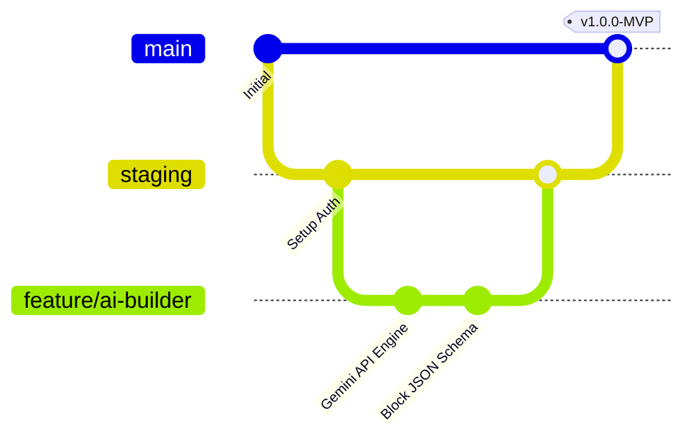

# 🐙 Tuneliva - Guide Git & Déploiement GitHub (Go to GitHub)

> Ce guide pas-à-pas fournit toutes les instructions, conventions de branches et commandes Git pour initialiser, versionner et collaborer efficacement sur le code source de **Tuneliva**.

---

## 1. Initialisation et Premier Push sur GitHub

### Étape 1 : Créer le dépôt sur GitHub
1. Connectez-vous sur [github.com](https://github.com).
2. Cliquez sur le bouton vert **"New"** (Nouveau dépôt).
3. Nommez le dépôt : `tuneliva` (ou `tuneliva-app`).
4. Choisissez la visibilité : **Private** (Recommandé pour un projet commercial).
5. **Ne cochez pas** "Add a README file" ou "Add .gitignore" (le projet en contient déjà).
6. Cliquez sur **"Create repository"**.

### Étape 2 : Lier le projet local au dépôt distant
Ouvrez votre terminal dans le dossier du projet `tuneliva` et exécutez les commandes suivantes :

```bash
# Vérifier l'état des fichiers
git status

# Ajouter tous les fichiers du projet
git add .

# Créer le premier commit officiel
git commit -m "feat: initialisation du socle Tuneliva (Next.js, Tailwind, Supabase, Allroadmapfiles)"

# Renommer la branche principale en 'main'
git branch -M main

# Associer votre dépôt GitHub (remplacez 'VOTRE_PSEUDO' par votre identifiant GitHub)
git remote add origin https://github.com/VOTRE_PSEUDO/tuneliva.git

# Envoyer le code sur GitHub
git push -u origin main
```

---

## 2. Stratégie de Branches (Git Flow Simplifié)

Pour maintenir une application stable tout en développant rapidement :



1. **`main` (Production)** :
   * Contient uniquement le code 100% testé et déployé pour les vrais clients.
   * Tout push sur `main` déclenche le déploiement automatique sur Vercel.
2. **`staging` (Pré-production)** :
   * Branche de test où l'on regroupe les nouvelles fonctionnalités avant le lancement officiel.
3. **`feature/[nom-de-la-fonctionnalite]` (Branches de travail)** :
   * Pour chaque nouvelle tâche (ex: `feature/fedapay-checkout`, `feature/mobile-pwa`, `feature/ai-editor`).

---

## 3. Commandes Quotidiennes Indispensables

### Créer une nouvelle branche de fonctionnalité :
```bash
# Se placer sur staging ou main et mettre à jour le code
git checkout main
git pull origin main

# Créer et basculer sur la nouvelle branche
git checkout -b feature/ai-generator
```

### Valider et pousser ses modifications :
```bash
# Voir ce qui a changé
git status

# Ajouter les modifications
git add .

# Enregistrer avec un message conventionnel
git commit -m "feat(ai): ajout du prompt système et du parsing JSON des blocs"

# Pousser la branche sur GitHub
git push -u origin feature/ai-generator
```

---

## 4. Conventions de Messages de Commit (Conventional Commits)

Pour que n'importe quel développeur comprenne immédiatement l'historique :

* `feat: ...` : Ajout d'une nouvelle fonctionnalité (ex: `feat: integration du checkout fedapay`).
* `fix: ...` : Correction d'un bug (ex: `fix: calcul du montant en FCFA sur mobile`).
* `style: ...` : Améliorations CSS, couleurs ou design sans impact sur la logique.
* `refactor: ...` : Nettoyage de code sans changement de fonctionnalité.
* `docs: ...` : Modification des fichiers de documentation (`Allroadmapfiles`).
* `perf: ...` : Optimisation du temps de chargement ou de la vitesse d'exécution.

---

## 5. Guide pour les Futurs Développeurs / Collaborateurs

Si un développeur rejoint le projet pour vous aider :

1. Il clone le dépôt :  
   `git clone https://github.com/VOTRE_PSEUDO/tuneliva.git`
2. Il installe les dépendances :  
   `npm install`
3. Il crée son fichier `.env.local` avec les clés Supabase et Gemini.
4. Il lance le serveur de développement :  
   `npm run dev`
