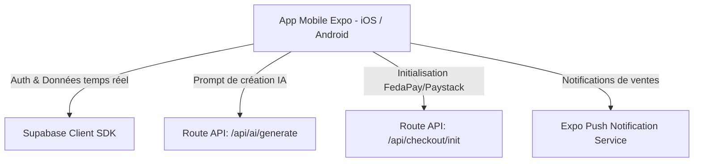

# 📱 Tuneliva - Guide de Transition Mobile Native (Go to Mobile)

> Ce document explique la stratégie technique pour faire évoluer Tuneliva de sa version **PWA Mobile-First** actuelle vers une véritable **Application Mobile Native (iOS / Android)** sur l'App Store et le Google Play Store.

---

## 1. Pourquoi commencer en PWA et quand passer au Mobile Natif ?

* **Phase 1 (Actuelle - MVP) : Web Responsive + PWA**
  * Zéro commission Apple/Google (0% au lieu de 30%).
  * Déploiement instantané sans validation de store.
  * Accès universel via un simple lien partagé sur WhatsApp ou Facebook.
* **Phase 2 (Scalabilité - Mois 6 à 12) : Application Mobile Dédiée**
  * Quand déployer l'application native : lorsque vous aurez plus de 200 vendeurs réguliers qui demandent des notifications push de vente avec sonnerie personnalisée ("Cha-ching !" à chaque commande reçue), un mode hors-ligne complet et une présence officielle sur le Play Store.

---

## 2. Le Choix de Technologie Mobile Recommandé : **React Native (Expo)**

Comme le code de Tuneliva est déjà écrit en **React / TypeScript**, le choix le plus rentable et le plus rapide est **React Native avec Expo (Expo SDK)**.

* **Pourquoi Expo ?**
  * 70% de la logique métier (appels Supabase, types TypeScript, calculs de devises, formatage des commandes) peut être réutilisée directement.
  * Pas besoin de Mac pour compiler la version Android.
  * Mises à jour instantanées "Over-The-Air" (OTA) sans repasser par la validation des stores.

---

## 3. Architecture d'Interaction API (Comment l'app mobile parlera à Tuneliva)

L'application mobile n'a pas besoin de réécrire la logique serveur : elle consommera directement les **APIs Next.js** et le backend **Supabase** déjà en place.



### Endpoints Clés réutilisables par l'App Mobile :

1. **`POST /api/ai/generate`** :
   * Envoi du prompt en texte ou en vocal.
   * Retourne la structure JSON complète de la page de vente.
2. **`POST /api/ai/refine`** :
   * Retouche magique d'un bloc de texte spécifique.
3. **`GET /api/projects/:id/orders`** :
   * Liste des commandes reçues avec filtres (Nouvelles, Confirmées, Livrées).
4. **`POST /api/checkout/verify`** :
   * Vérification des transactions Mobile Money et recharges de crédits.

---

## 4. Notifications Push Natives pour les Vendeurs (La Killer Feature)

L'avantage n°1 d'une application mobile pour les commerçants est la **notification instantanée de vente** :

1. Un acheteur passe une commande sur la landing page web.
2. Un webhook Supabase (`DATABASE WEBHOOK`) déclenche l'envoi d'une notification push via **Expo Push Notifications** ou **Firebase Cloud Messaging (FCM)**.
3. Le smartphone du vendeur sonne instantanément :  
   🔔 *"Nouvelle commande ! [Nom du client] vient de commander pour 25 000 FCFA à Cotonou !"*
4. En cliquant sur la notification, l'application s'ouvre directement sur le bouton : **"Contacter le client sur WhatsApp"** ou **"Appeler le client"**.

---

## 5. Feuille de Route pour le Développement Mobile

1. **Création du projet Expo** :
   ```bash
   npx create-expo-app tuneliva-mobile --template blank-typescript
   ```
2. **Installation du SDK Supabase** :
   ```bash
   npx expo install @supabase/supabase-js @react-native-async-storage/async-storage
   ```
3. **Partage des Types** : Importer le dossier `types/` du projet Next.js pour avoir exactement les mêmes définitions d'objets (`Project`, `Page`, `Order`).
4. **Publication sur les Stores** via **EAS Build** (`eas build -p android --profile production`).
