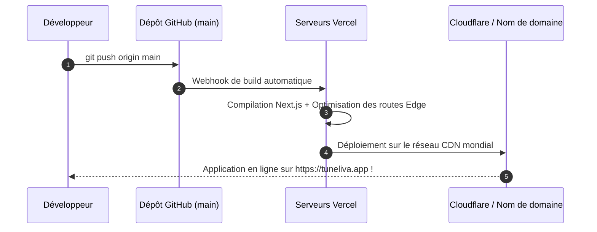

# 🚀 Tuneliva - Guide de Passage en Production (Go to Prod)

> Ce guide récapitule toutes les étapes indispensables pour déployer **Tuneliva** en environnement de production réel, sécurisé, rapide et prêt à accueillir des milliers d'utilisateurs.

---

## 1. Pré-requis pour la Production

Avant de lancer le déploiement, assurez-vous d'avoir :
* [ ] Un compte [Vercel](https://vercel.com) (hébergement frontend & edge serverless gratuit au démarrage).
* [ ] Un compte [Supabase](https://supabase.com) (base de données et authentification).
* [ ] Une clé API gratuite [Google AI Studio (Gemini)](https://aistudio.google.com).
* [ ] Vos identifiants marchands [FedaPay](https://fedapay.com) (Mode Live).
* [ ] Votre nom de domaine réservé (ex: `tuneliva.app` ou `tuneliva.com`).

---

## 2. Configuration des Variables d'Environnement

Créez un fichier `.env.local` en local et renseignez ces mêmes variables dans les **Settings $\rightarrow$ Environment Variables** de votre projet Vercel :

```env
# ===================================================
# 1. SUPABASE (Base de données & Auth)
# ===================================================
NEXT_PUBLIC_SUPABASE_URL=https://votre-projet.supabase.co
NEXT_PUBLIC_SUPABASE_ANON_KEY=votre-cle-publique-anon
SUPABASE_SERVICE_ROLE_KEY=votre-cle-secrete-service-role

# ===================================================
# 2. GOOGLE GEMINI FLASH (Moteur IA 100% Gratuit)
# ===================================================
GEMINI_API_KEY=votre-cle-api-google-ai-studio

# ===================================================
# 3. FEDAPAY (Paiements Mobile Money UEMOA/CEMAC)
# ===================================================
NEXT_PUBLIC_FEDAPAY_PUBLIC_KEY=pk_live_votre_cle_publique
FEDAPAY_SECRET_KEY=sk_live_votre_cle_secrete
FEDAPAY_ENVIRONMENT=live

# ===================================================
# 4. PAYSTACK & STRIPE (Anglophone & International)
# ===================================================
NEXT_PUBLIC_PAYSTACK_PUBLIC_KEY=pk_live_votre_cle_paystack
PAYSTACK_SECRET_KEY=sk_live_votre_cle_paystack
STRIPE_SECRET_KEY=sk_live_votre_cle_stripe

# ===================================================
# 5. CONFIGURATION DOMAINES & APPLICATION
# ===================================================
NEXT_PUBLIC_APP_URL=https://tuneliva.app
NEXT_PUBLIC_ROOT_DOMAIN=tuneliva.app
```

---

## 3. Déploiement en 1 Clic sur Vercel



1. Rendez-vous sur votre dashboard **Vercel**.
2. Cliquez sur **"Add New..." $\rightarrow$ "Project"**.
3. Importez votre dépôt GitHub `tuneliva`.
4. Dans la section **Environment Variables**, collez toutes les clés listées ci-dessus.
5. Cliquez sur **"Deploy"**. En 90 secondes, Tuneliva est en ligne !

---

## 4. Configuration DNS des Domaines et Sous-Domaines

Pour que chaque utilisateur bénéficie automatiquement de son sous-domaine (ex: `boutique.tuneliva.app`), configurez vos enregistrements DNS chez votre registrar ou sur Cloudflare :

| Type | Nom / Hôte | Valeur / Cible | Utilité |
| :--- | :--- | :--- | :--- |
| **A** | `@` | `76.76.21.21` (IP Vercel) | Pointeur vers le site principal `tuneliva.app` |
| **CNAME** | `www` | `cname.vercel-dns.com` | Redirection de `www.tuneliva.app` |
| **CNAME** | `*` (Wildcard) | `cname.vercel-dns.com` | **Permet la création infinie de sous-domaines instantanés (`*.tuneliva.app`)** |

---

## 5. Checklist de Sécurité & Performance avant le Lancement

- [ ] **Exécuter `database.sql`** dans l'éditeur Supabase pour créer toutes les tables et politiques RLS.
- [ ] **Activer la protection contre les spams** sur les formulaires de commande (rate limiting ou honeypot invisible).
- [ ] **Tester un vrai paiement Mobile Money de 100 FCFA** via FedaPay en mode réel pour valider le webhook de confirmation.
- [ ] **Vérifier le manifest PWA** dans les outils de développement Chrome (Lighthouse Audit $\rightarrow$ PWA validée).
- [ ] **Tester la vitesse de chargement** sur [PageSpeed Insights](https://pagespeed.web.dev) : viser un score mobile > 90/100.
