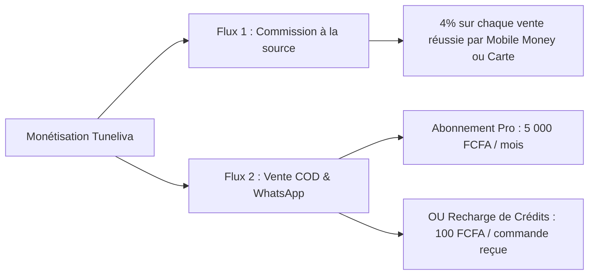
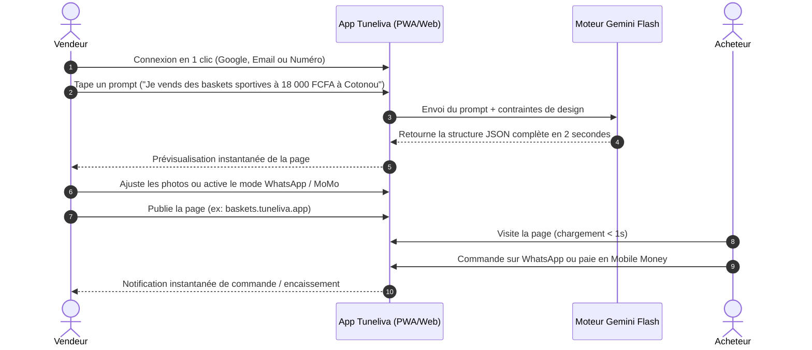

# 🚀 Tuneliva - Vue d'ensemble du Projet (Project Overview)

> **"Donnez vie à vos ventes"**  
> *Le constructeur de tunnels de vente et landing pages IA nouvelle génération, ultra-rapide (< 1s), optimisé pour l'Afrique et l'International avec encaissement Mobile Money et commande WhatsApp intégrée.*

---

## 1. Vision et Mission

**Tuneliva** est une plateforme SaaS conçue pour combler le fossé entre les outils de marketing occidentaux complexes, lourds et inadaptés (Systeme.io, ClickFunnels, WordPress) et la réalité économique et technologique des entrepreneurs modernes en Afrique et à l'international.

* **Le Problème constaté :**
  1. **Lenteur et abandons massifs** : Les pages de vente traditionnelles pèsent plusieurs mégaoctets et mettent 4 à 8 secondes à charger sur les réseaux mobiles 3G/4G en Afrique subsaharienne. Cela engendre une perte de plus de 50% du budget publicitaire des annonceurs.
  2. **Friction de paiement et de commande** : Les plateformes mondiales imposent la carte bancaire. Or, en Afrique, plus de 80% des transactions s'effectuent via **Mobile Money** ou avec **paiement en espèces à la livraison (Cash on Delivery - COD)** après confirmation sur **WhatsApp**.
  3. **Complexité des éditeurs sur mobile** : Les constructeurs de pages drag-and-drop classiques sont inutilisables sur smartphone, alors que la majorité des commerçants et freelances africains gèrent leur activité directement depuis leur téléphone.
  4. **Designs datés** : Les templates disponibles sur le marché francophone datent souvent des années 2012-2015.

* **La Mission de Tuneliva :**  
  Permettre à n'importe quel entrepreneur, créateur ou PME de décrire son produit en quelques mots, d'obtenir en 60 secondes une landing page moderne digne des standards de design 2026, ultralégère (chargement < 1s), et prête à encaisser par Mobile Money ou à recevoir des commandes directes sur WhatsApp / Cash on Delivery.

---

## 2. Les Cibles Utilisateurs (Personas)

| Profil | Description & Besoins | Pourquoi ils choisissent Tuneliva |
| :--- | :--- | :--- |
| **L'E-commerçant / Media Buyer Africain** | Vend des produits physiques (mode, beauté, gadgets) via des publicités Facebook, TikTok et WhatsApp. | Ses pages chargent instantanément sur mobile ; le formulaire COD et la commande WhatsApp doublent son taux de conversion. |
| **L'Infopreneur / Coach / Formateur** | Vend des formations, e-books, coachings ou webinaires au Bénin, Côte d'Ivoire, Sénégal, Cameroun et auprès de la diaspora. | Encaissement direct en FCFA, GHS, NGN ou devises étrangères sans blocage de carte bancaire. |
| **L'Artisan / Prestataire de Services** | Électricien, traiteur, agence locale, freelance qui a besoin d'une page professionnelle pour présenter ses réalisations. | Pas besoin de compétences techniques ni de dépenser 200 000 FCFA pour une agence : une page pro en 1 prompt. |
| **Le Vendeur International / Diaspora** | Africains de l'étranger ou créateurs vendant à la fois en Occident et en Afrique. | Détection automatique de devise (EUR, USD, XOF, XAF, etc.) et double passerelle (Stripe / Paystack / FedaPay). |

---

## 3. Les Piliers Différenciateurs de Tuneliva

1. **Vitesse éclair (< 800ms)** : Architecture en HTML pur compilé et servi via Edge CDN. Moins de 150 Ko par page publique.
2. **Génération IA en 1 Clic (Gratuite & Illimitée via Gemini Flash)** : L'IA rédige des textes de vente percutants adaptés aux réalités du marché local et assemble le design automatiquement.
3. **Éditeur par Sections Mobile-First** : Pensé pour les pouces sur smartphone avec boutons magiques IA par section (pas de drag-and-drop encombrant).
4. **Le Double Checkout Hybride** :
   * Encaissement en ligne instantané : Mobile Money (MTN, Moov, Orange, Wave) + Cartes bancaires internationales.
   * Commande WhatsApp en 1 clic + Formulaire Cash on Delivery (Paiement à la livraison).
5. **Multi-Devise Contextuelle** : Détection géographique par IP du visiteur avec affichage des prix dans sa devise locale (XOF, XAF, GHS, NGN, EUR, USD).
6. **Mobile PWA Installable** : L'application Tuneliva s'installe sur smartphone sans passer par les stores d'applications, évitant la taxe de 30% d'Apple et Google.

---

## 4. Modèle Économique et Monétisation

Tuneliva combine deux flux de revenus complémentaires pour maximiser la rentabilité :

1. **Vente en ligne directe (Paiements numériques)** :
   * Accès gratuit à la plateforme.
   * Prélèvement automatique d'une **commission de 4%** sur le montant de la transaction au moment du paiement en ligne.
2. **Commandes Cash on Delivery / WhatsApp** :
   * **Option A (Abonnement)** : 5 000 FCFA / mois (ou formule annuelle à 50 000 FCFA).
   * **Option B (Pay-per-lead / Crédits de commande)** : L'utilisateur recharge son portefeuille (ex: 5 000 FCFA) et chaque commande COD validée déduit 100 FCFA de son solde.

---

## 5. Parcours Utilisateur Simplifié

